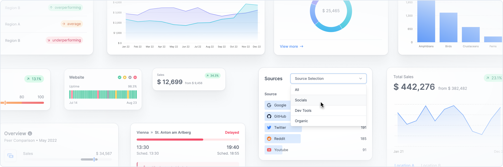

<br>
<br>
<br>
<div align="center">
  
<br>
<br>
<br>

  <div align="center">
    <a href="https://www.npmjs.com/package/@garmz/react">
      
    </a>
    <a href="https://garmz.so/docs/getting-started/introduction">
      
    </a>
    <a href="https://github.com/garmzlabs/garmz/blob/main/License">
      
    </a>
    <a href="https://join.slack.com/t/garmz-community/shared_invite/zt-21ug6czv6-RckDPEAR6GdYOqfMGKOWpQ">
      
    </a>
    <!-- <a href="https://twitter.com/intent/follow?screen_name=garmzlabs">
      
    </a> -->
        <a href="https://twitter.com/intent/follow?screen_name=garmzlabs">
      
    </a>
    
  </div>
  <h3 align="center">
    <a href="https://www.garmz.so/docs/getting-started/installation">Documentation</a> &bull;
    <a href="https://www.garmz.so">Website</a>
  </h3>

<br>

  <h1>The react library to build dashboards fast</h1>

</div>

[Garmz](https://garmz.so/) lets you create simple and modular components to build insightful dashboards in a breeze. Fully open-source, made by data scientists and software engineers with a sweet spot for design.

<br>
<br>



<br>
<br>

## Getting Started

For new projects, we recommend using Next.js 13.4+. For other frameworks, see our [Installation Guide](https://www.garmz.so/docs/getting-started/installation). To make use of the library we also need Tailwind CSS setup in the project. For manual installation, refer to the installation guide on our website.

<br>

## Using NextJS

In your terminal, we create a new Next project. When prompted `Would you like to use Tailwind CSS with this project?`, select `Yes`.

```bash
npx create-next-app@latest my-project
cd my-project
```

### Installation using the Garmz CLI

We recommend installing Garmz with our CLI. To do so, run this command and select Next as your framework. If you prefer a manual installation, check the [installation guide](https://www.garmz.so/docs/getting-started/installation) on our website.

```bash
npx @garmz/cli@latest init
```

Now you are set and you can start the dev server.

```bash
npm run dev
```

## Example

With Garmz creating an analytical interface is easy.

<br>

```jsx
//Card.tsx
import { Card, Text, Metric, Flex, ProgressBar } from "@garmz/react";
export default () => (
  <Card className="max-w-sm">
    <Text>Sales</Text>
    <Metric>$ 71,465</Metric>
    <Flex className="mt-4">
      <Text>32% of annual target</Text>
      <Text>$ 225,000</Text>
    </Flex>
    <ProgressBar value={32} className="mt-2" />
  </Card>
);
```

<br>


<br>

## Community and Contribution

We are always looking for new ideas or other ways to improve Garmz. If you have developed anything cool or found a bug, send us a pull request.
<br>
<br>

## License

[Apache License 2.0](https://github.com/garmzlabs/garmz/blob/main/License)

Copyright &copy; 2023 Garmz. All rights reserved.
